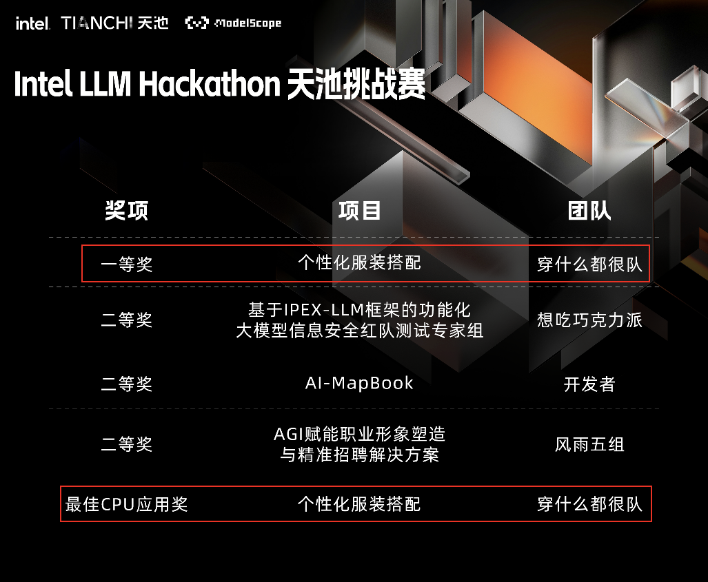
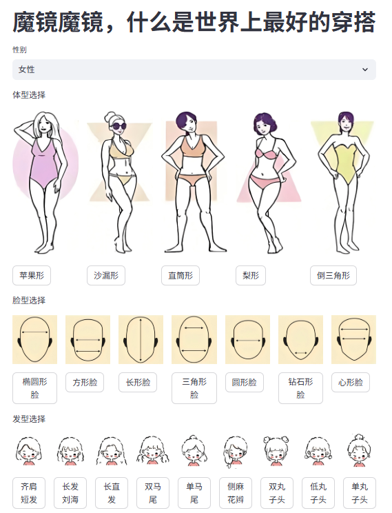
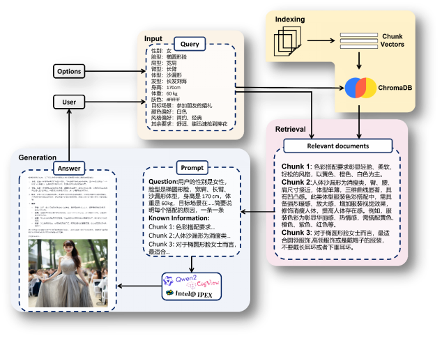

## 服装搭配助手

本项目致力于开发一款集成RAG（Retrieval-Augmented Generation）技术的服装搭配助手，通过结合大语言模型与向量检索增强技术，为用户提供个性化且时尚的服装搭配建议。系统将基于用户的具体需求和偏好，从丰富的时尚知识库中检索相关信息，从而生成符合用户偏好的创意搭配方案。并按照用户脸型、身材、发型等数据，可视化展示最终穿搭效果。



## 视频演示

点击下方图片，跳转至视频演示👇

[](https://www.bilibili.com/video/BV1hiYvzHEzz)

## 运行项目

* 创建运行的 ipex 环境

  ```bash
  conda create -n ipex python=3.10
  conda activate ipex
  pip install -r requirements.txt
  ```

* 下载大模型

  ```bash
  python install.py
  ```

* 配置智谱平台的 api_key ，用于生成最终的穿搭效果

  > 代码 app.py 第40行。

* 运行程序

  ```bash
  python -m streamlit run app.py 
  ```

  > 注意，首次运行会生成向量数据库，需要等待几分钟。

## 项目介绍



- [ ] **个性化服装推荐**：基于用户输入的个人信息和场合需求，提供定制化的服装搭配建议，并提供穿搭效果图。
- [ ] **丰富的知识库**：检索的专业知识来源于各大搜索引擎排名靠前（例如高PR值）的相关网页内容和专业度高的各大高校的硕博论文和服装领域的优秀论文，并使用Qwen2.0-7B-Instruct模型对这些知识进行了过滤筛选和归纳总结，在保证知识数量的同时也尽可能地保证了知识质量。
- [ ] **知识检索与增强**：系统利用HuggingFace Embedding将用户查询和时尚知识文本转换为向量表示，并通过ChromaVectorStore实现高效的向量检索，从庞大的时尚知识库中检索出最相关的信息，确保推荐内容的准确性和多样性。系统使用Qwen2.0-7B-Instruct模型，根据检索结果和用户查询生成自然、时尚的服装搭配建议。
- [ ] **用户友好的Web界面**：提供友好的 Web 界面，支持用户进行自然语言提问和查看回答。使用了Streamlit开源框架打造优雅且用户友好的前端界面。利用Streamlit提供的一系列小部件丰富用户选择，并使用了嵌入html等技术增加了取色器等工具，以帮助用户获取更加准确的信息，辅助打造更加定制化的方案。
- [ ] **直观图片展示**：用户只需输入对服装搭配的需求和偏好等信息，大语言模型便会基于这些输入生成精准的搭配建议。随后，文生图模型会根据这些建议生成对应的图像，直观展示推荐的服装组合。通过将文本信息转换为视觉呈现，改善了用户的使用体验，使得搭配建议更加直观。
- [ ] **使用IPEX-LLM**：Intel® LLM Library for PyTorch (IPEX-LLM) 是英特尔开源的大语言模型低比特优化库，可以高效的运行在英特尔®至强®可扩展处理器上。IPEX-LLM提供各种低位优化（例如INT3/NF3/INT4/NF4/INT5/INT8），并允许在低成本PC（仅限CPU）、带GPU的PC或云端运行LLM。

## 技术细节

* 考虑到知识片段中实际上会包含许多与查询本身无关的内容，比如一些上下文衔接句或者一些过渡句等等，即知识片段中所包含的可用知识密度较低，因此在知识片段上存在着可以进一步优化的空间。为了提高知识片段的知识密度和精简知识片段，我们在获取到一些相关的学术研究论文之后，先使用大模型对知识文档按固定大小分块的文本块进行归纳总结，提取知识片段中真正与查询相关的部分，将大模型对知识片段精简归纳生成的内容作为最终需要存储至向量数据库的内容。

* 在具体的参数设置上，为了在生成回答时检索到更多有用的信息，同时兼顾检索效率，我们在检索文本总长度为1536时尝试了块大小分别为256，384和512的情况，从检索效率上来看，384×4 ＞ 256×6 ＞ 512×3。在本项目中，我们最终选择了384作为块大小，从而获得最大的检索效率。